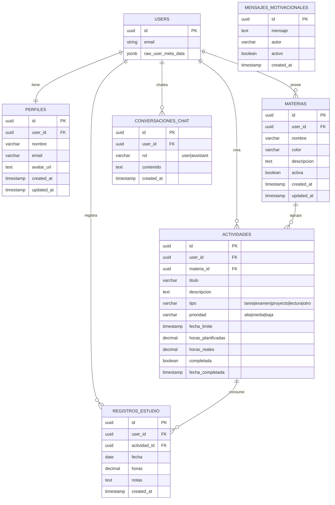
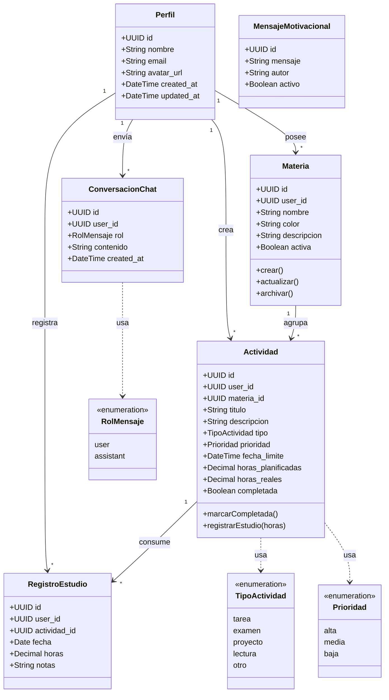

# 📚 Study Habits App

Aplicación web para gestionar hábitos de estudio, actividades académicas y recibir asistencia de un chatbot potenciado por IA (Google Gemini).

---

## 📋 Tabla de contenidos

- [Stack tecnológico](#-stack-tecnológico)
- [Requisitos previos](#-requisitos-previos)
- [Instalación paso a paso](#-instalación-paso-a-paso)
- [Variables de entorno](#-variables-de-entorno)
- [Scripts disponibles](#-scripts-disponibles)
- [Estructura del proyecto](#-estructura-del-proyecto)
- [Modelo de datos (UML)](#-modelo-de-datos-uml)
- [Troubleshooting](#-troubleshooting)

---

## 🛠 Stack tecnológico

| Capa | Tecnología |
|------|-----------|
| **Frontend** | React 18 + Vite 5 |
| **Enrutado** | React Router v6 |
| **Estilos** | Tailwind CSS 3 |
| **Gráficos** | Recharts |
| **Backend / DB / Auth** | Supabase (PostgreSQL + Auth + RLS) |
| **IA** | Google Gemini 2.5 Flash (gratis) |
| **Exportación PDF** | jsPDF + html2canvas |
| **Iconos** | Lucide React |
| **Lenguaje** | JavaScript (ES Modules, JSX) |

---

## ✅ Requisitos previos

Antes de empezar, necesitas tener instalado:

- **[Node.js](https://nodejs.org/)** ≥ 18.x (incluye npm)
- **[Git](https://git-scm.com/)**
- Una cuenta gratuita en:
  - **[Supabase](https://supabase.com/)** — base de datos + autenticación
  - **[Google AI Studio](https://aistudio.google.com/app/apikey)** — API key de Gemini

Verifica tu instalación:
```bash
node --version   # v18.x o superior
npm --version    # 9.x o superior
git --version
```

---

## 🚀 Instalación paso a paso

### 1. Clonar el repositorio
```bash
git clone <url-del-repositorio>
cd study-habits-app
```

### 2. Instalar dependencias
```bash
npm install
```

### 3. Configurar Supabase

1. Entra a [supabase.com](https://supabase.com) → **New Project**
2. Define un nombre, contraseña segura para la DB y región
3. Espera ~2 minutos mientras Supabase aprovisiona el proyecto
4. Una vez listo, ve a **SQL Editor** (menú lateral izquierdo)
5. Abre el archivo `supabase/schema.sql` de este repo
6. Copia **todo su contenido** → pégalo en el SQL Editor → **Run**
7. Esto crea todas las tablas, políticas RLS, triggers y datos iniciales

> **📍 ¿Dónde encontrar las credenciales?**
> Ve a ⚙️ **Settings → Data API**. Ahí están:
> - **Project URL** → `VITE_SUPABASE_URL`
> - **anon / public key** → `VITE_SUPABASE_ANON_KEY`

### 4. Obtener API key de Google Gemini (gratis)

1. Entra a [aistudio.google.com/app/apikey](https://aistudio.google.com/app/apikey)
2. Inicia sesión con tu cuenta de Google
3. Click en **Create API key** → **Create API key in new project**
4. Copia la clave generada (empieza con `AIza...`)

**Límites del plan gratuito:** 1,500 requests/día, 15 req/min — suficiente para uso personal.

### 5. Crear archivo `.env`

En la raíz del proyecto (al mismo nivel que `package.json`), crea un archivo llamado `.env`:

```env
VITE_SUPABASE_URL=https://tuproyecto.supabase.co
VITE_SUPABASE_ANON_KEY=eyJhbGciOi...tu-anon-key
VITE_GEMINI_API_KEY=AIza...tu-gemini-key
```

> ⚠️ El `.env` está ignorado por `.gitignore` — **nunca** lo subas al repo.

### 6. Correr el proyecto

```bash
npm run dev
```

El servidor arranca en [http://localhost:3000](http://localhost:3000) y se abre automáticamente en tu navegador.

### 7. Crear tu cuenta

1. En la pantalla de login, click en **Registrarse**
2. Completa el formulario (nombre + email + password)
3. Supabase crea el usuario y **automáticamente** un perfil asociado (por trigger SQL)
4. ¡Listo! Ya puedes crear materias, actividades y usar el chat con IA

---

## 🔐 Variables de entorno

| Variable | Descripción | Dónde obtenerla |
|----------|-------------|-----------------|
| `VITE_SUPABASE_URL` | URL del proyecto Supabase | Supabase → Settings → Data API |
| `VITE_SUPABASE_ANON_KEY` | Clave pública anon de Supabase | Supabase → Settings → Data API |
| `VITE_GEMINI_API_KEY` | Clave de Google Gemini | [aistudio.google.com/app/apikey](https://aistudio.google.com/app/apikey) |

---

## 📜 Scripts disponibles

| Comando | Descripción |
|---------|-------------|
| `npm run dev` | Inicia servidor de desarrollo en `localhost:3000` con hot reload |
| `npm run build` | Genera build de producción optimizado en `/dist` |
| `npm run preview` | Sirve localmente el build de producción (para verificarlo) |
| `npm run lint` | Ejecuta ESLint sobre archivos `.js` y `.jsx` |

---

## 📂 Estructura del proyecto

```
study-habits-app/
├── src/
│   ├── main.jsx                  # Punto de entrada React
│   ├── App.jsx                   # Router + rutas protegidas
│   ├── components/
│   │   ├── chat/ChatWidget.jsx   # Widget de chat del dashboard
│   │   ├── activities/           # Modales de actividades
│   │   ├── dashboard/            # Gráficos y cards del dashboard
│   │   ├── layout/Layout.jsx     # Layout con sidebar
│   │   └── ui/                   # Componentes UI reutilizables
│   ├── pages/
│   │   ├── LoginPage.jsx
│   │   ├── RegisterPage.jsx
│   │   ├── DashboardPage.jsx     # Home con resumen + mensaje IA
│   │   ├── ActividadesPage.jsx   # CRUD de actividades
│   │   ├── MateriasPage.jsx      # CRUD de materias
│   │   ├── EstadisticasPage.jsx  # Reportes + export PDF
│   │   ├── ChatPage.jsx          # Chat completo con Gemini
│   │   └── ConfiguracionPage.jsx # Perfil del usuario
│   ├── context/AuthContext.jsx   # Estado global de auth
│   ├── hooks/
│   │   ├── useAuth.js            # Hook de autenticación
│   │   └── useSupabase.js        # Hooks de datos (materias, actividades…)
│   ├── lib/supabase.js           # Cliente Supabase inicializado
│   └── styles/globals.css        # Estilos Tailwind globales
├── supabase/
│   └── schema.sql                # ⚡ Ejecutar en SQL Editor de Supabase
├── public/                       # Assets estáticos
├── .env                          # Variables de entorno (no en git)
├── index.html                    # HTML raíz
├── vite.config.js                # Config de Vite (alias @, puerto 3000)
├── tailwind.config.js            # Tema de Tailwind
└── package.json
```

---

## 🗄 Modelo de datos (UML)

### Diagrama Entidad-Relación



### Diagrama de clases (UML)



### Reglas clave del modelo

- **Row-Level Security (RLS):** cada usuario solo puede ver/modificar **sus propios** datos — aplicado a todas las tablas excepto `mensajes_motivacionales` (lectura pública).
- **Creación automática de perfil:** el trigger `on_auth_user_created` crea un registro en `perfiles` cuando se registra un usuario en `auth.users`.
- **Sincronización de horas:** el trigger `sync_horas_reales_trigger` actualiza `actividades.horas_reales` automáticamente al insertar/modificar/borrar `registros_estudio`.
- **Cascada de borrado:** al eliminar un usuario, se borran en cascada sus perfiles, materias, actividades, registros y chats.
- **Vistas precalculadas:** `estadisticas_actividades` y `resumen_semanal` con `security_barrier` para respetar RLS.

---

## 🔧 Troubleshooting

### El chat responde "error al procesar tu mensaje"
- Verifica que `VITE_GEMINI_API_KEY` esté bien puesta en `.env`
- Reinicia el servidor (`Ctrl+C` + `npm run dev`) — Vite solo carga `.env` al arrancar
- Revisa la consola del navegador para ver el error exacto

### Errores al conectar con Supabase
- Asegúrate de haber ejecutado el `schema.sql` completo
- Verifica que `VITE_SUPABASE_URL` y `VITE_SUPABASE_ANON_KEY` correspondan al mismo proyecto
- Confirma que las políticas RLS están activas (se aplican por el schema)

### El mensaje motivacional no aparece
- Normal si la IA falla silenciosamente → el código tiene fallback a la tabla `mensajes_motivacionales`
- Asegúrate de que el schema SQL se ejecutó hasta el final (los `INSERT` están al final)

### "Port 3000 already in use"
- Otro proceso está usando ese puerto. Ciérralo o cambia el puerto en `vite.config.js`

---

## 📄 Licencia

Ver archivo [LICENSE](./LICENSE).
